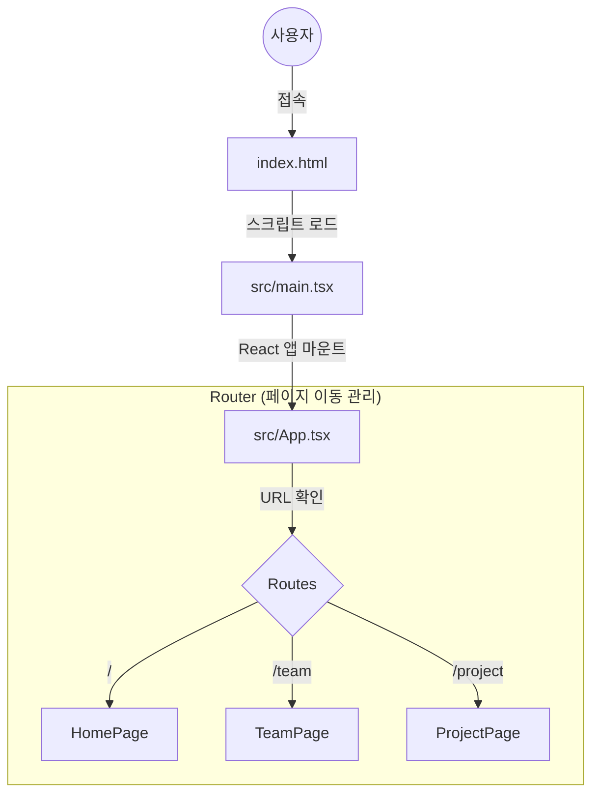
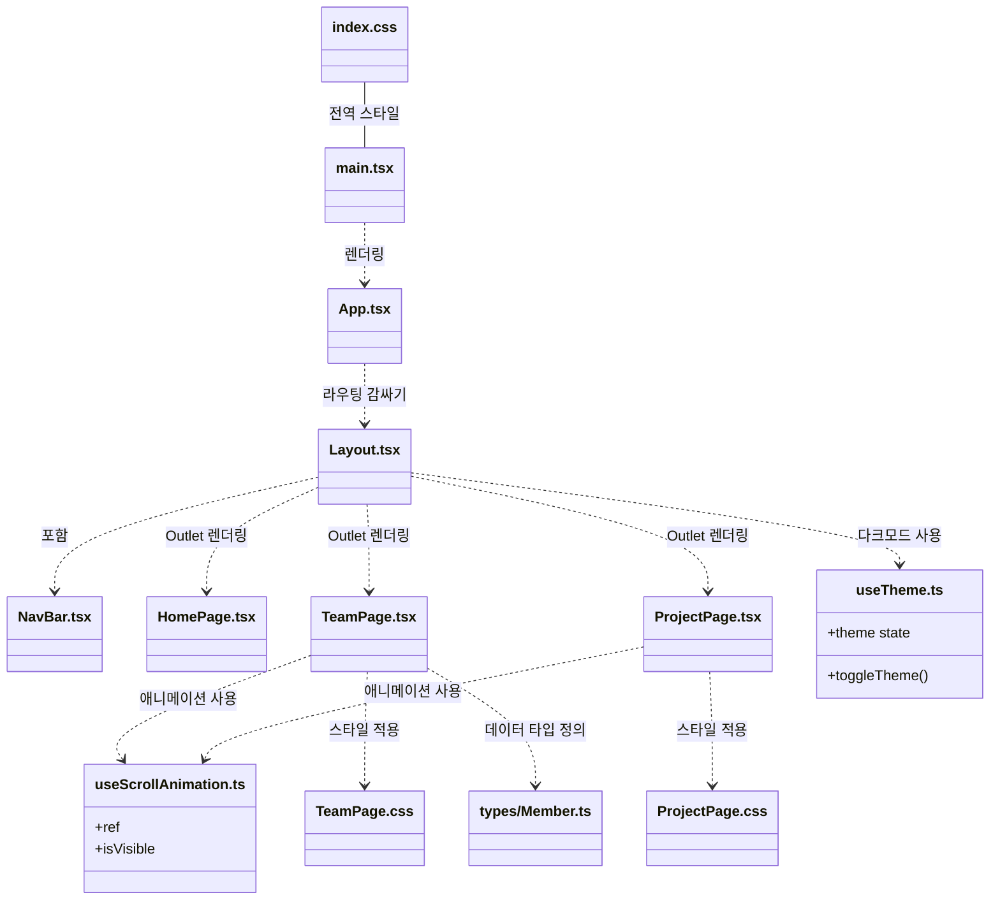

# 프로젝트 구조 및 데이터 흐름도

이 문서는 `Clap Campus` 웹 프로젝트가 어떻게 구성되어 있고, 각 파일들이 서로 어떻게 연결되어 작동하는지를 시각적으로 설명합니다.

## 1. 전체 아키텍처 (High Level)

웹 브라우저가 사이트에 접속했을 때 실행되는 큰 흐름입니다.

## 2. 컴포넌트 및 데이터 관계도 (Detailed)

각 파일(컴포넌트)이 어떤 다른 파일들을 가져다(Import) 쓰고 있는지, 그리고 스타일과 훅(Hook)은 어디에 연결되는지 보여줍니다.

## 3. 핵심 동작 원리 설명

### 1. 진입점 (`main.tsx`)
- 모든 React 앱의 시작점입니다.
- `index.html`에 있는 `

` 안에 우리 앱을 집어넣습니다.
- `index.css`를 불러와서 앱 전체의 기본 스타일(폰트, 배경색 등)을 잡습니다.

### 2. 길잡이 (`App.tsx`)
- **라우터(Router)** 역할을 합니다.
- 주소창의 URL을 보고 "지금 어떤 페이지를 보여줘야 할지" 결정합니다.
- 모든 페이지의 공통 틀인 `Layout` 컴포넌트를 가장 먼저 띄웁니다.

### 3. 골격 (`Layout.tsx`)
- **헤더(NavBar)**와 **푸터**가 여기에 있습니다.
- `Outlet`이라는 특수한 공간이 있는데, URL에 따라 변하는 페이지 내용(`HomePage`, `TeamPage`..)이 바로 이 `Outlet` 자리에 갈아 끼워집니다.
- **다크 모드(`useTheme`)** 기능이 여기서 작동하여 앱 전체의 색상을 제어합니다.

### 4. 페이지 (`pages/`)
- 실제 화면 내용을 담고 있습니다.
- `TeamPage`: `types/Member.ts`에 정의된 데이터 구조를 이용해 팀원 목록을 보여줍니다.
- `ProjectPage`: 작업자와 업무 목록 상태(`useState`)를 관리하고 드래그 앤 드롭 기능을 수행합니다.
- 각 페이지는 등장할 때 `useScrollAnimation` 훅을 사용해 스르륵 나타나는 효과를 냅니다.
